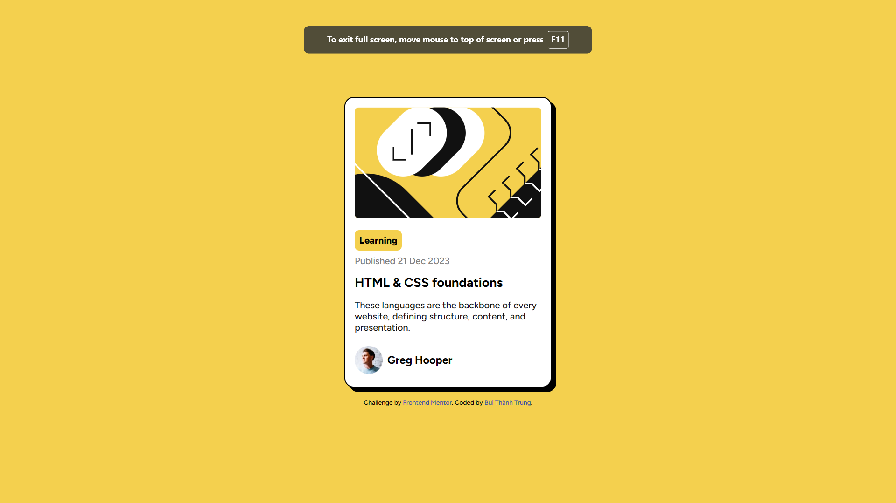

This is a solution to the [Blog preview card challenge on Frontend Mentor](https://www.frontendmentor.io/challenges/blog-preview-card-ckPaj01IcS).

## Table of contents

- [Overview](#overview)
  - [The challenge](#the-challenge)
  - [Screenshot](#screenshot)
  - [Links](#links)
- [My process](#my-process)
  - [Built with](#built-with)
  - [What I learned](#what-i-learned)
  - [Continued development](#continued-development)
  - [Useful resources](#useful-resources)
- [Author](#author)
- [Acknowledgments](#acknowledgments)

## Overview

### The challenge

Users should be able to:

- See hover and focus states for all interactive elements on the page

### Screenshot

### Links

- Solution URL: https://github.com/bttrvng99/blog-preview-card-main
- Live Site URL: https://bttrvng99.github.io/blog-preview-card-main/

## My process

### Built with

Pure HTML and CSS

### What I learned

- How to use box-shadow
- How to use hover attribute to elements

### Continued development

### Useful resources

## Author

## Acknowledgements
